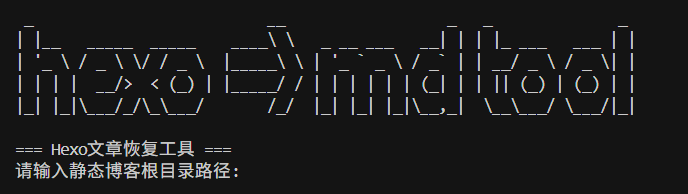

# Hexo 博客文章恢复工具

这是一个用于恢复 Hexo 博客文章的 Python 工具。它可以将 HTML 格式的博客文章转换回 Markdown 格式，并保留文章的元数据（如标题、日期、分类、标签等）和图片资源。

## 功能特点

- 从 HTML 文件中提取文章内容并转换为 Markdown 格式
- 自动提取文章元数据（Front-matter）：
  - 标题（title）
  - 创建日期（date）
  - 更新日期（updated）
  - 分类（categories）
  - 标签（tags）
- 自动复制和处理文章中的图片资源
- 智能处理文件名，避免重复
- 支持相对路径和绝对路径的图片资源

## 环境要求

- Python 3.x
- 依赖包：
  - beautifulsoup4 >= 4.12.0
  - html2text >= 2020.1.16

## 安装

1. 克隆仓库：
```bash
git clone [仓库地址]
cd hexo_recover
```

2. 安装依赖：
```bash
pip install -r requirements.txt
```

## 使用方法

1. 准备工作：
   - 将需要恢复的 HTML 文件放在一个目录中，一般直接下静态存储库就行
   - 创建用于存放输出的 Markdown 文件目录
   - 创建用于存放图片资源的目录

2. 运行脚本：
```bash
python recover.py
```
